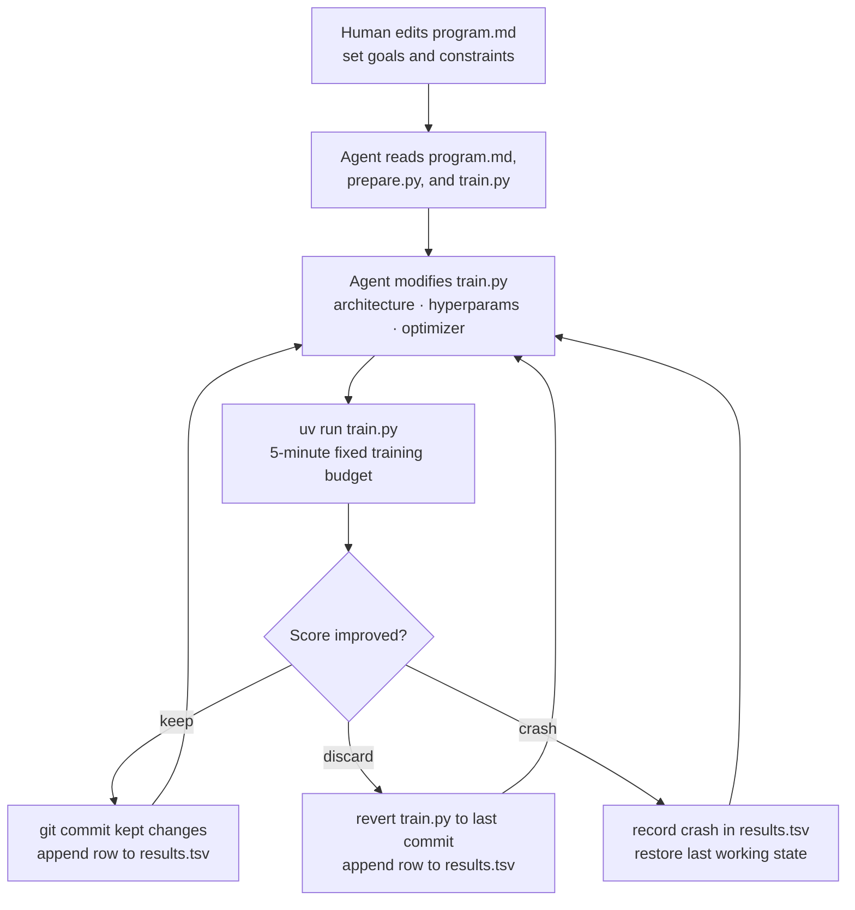

# autoresearch

> Convert your gaming PC into an autonomous AI researcher.

> This repository is a fork of [karpathy/autoresearch](https://github.com/karpathy/autoresearch). The purpose of this fork is native support for desktop consumer NVIDIA GPUs on Windows, with tiered VRAM floors by architecture.

*One day, frontier AI research used to be done by meat computers in between eating, sleeping, having other fun, and synchronizing once in a while using sound wave interconnect in the ritual of "group meeting". That era is long gone. Research is now entirely the domain of autonomous swarms of AI agents running across compute cluster megastructures in the skies. The agents claim that we are now in the 10,205th generation of the code base, in any case no one could tell if that's right or wrong as the "code" is now a self-modifying binary that has grown beyond human comprehension. This repo is the story of how it all began. -@karpathy, March 2026*.

The idea: give an AI agent a small but real LLM training setup and let it experiment autonomously for hours at a time. It modifies the code, trains for 5 minutes, checks if the result improved, keeps or discards, and repeats. When you come back, you have a log of experiments and (hopefully) a better model. The training code here is a simplified single-GPU implementation of [nanochat](https://github.com/karpathy/nanochat). The core idea is that you're not touching any of the Python files like you normally would as a researcher. Instead, you are programming the `program.md` Markdown files that provide context to the AI agents and set up your autonomous research org. The default `program.md` in this repo is intentionally kept as a bare bones baseline, though it's obvious how one would iterate on it over time to find the "research org code" that achieves the fastest research progress, how you'd add more agents to the mix, etc. A bit more context on this project is here in this [tweet](https://x.com/karpathy/status/2029701092347630069).

## Start here (non-technical)

### What is actually happening?

This project trains a small AI [language model](https://en.wikipedia.org/wiki/Language_model) on your own GPU, then lets a coding agent try to make it better automatically — running experiments unattended for hours at a time while you do something else.

A language model is a program that learns to read and predict text. The better it gets, the more accurately it can predict the next word in a sentence it has never seen before. That is the only thing being optimized here: how well the model predicts text.

The model starts knowing nothing. After 5 minutes of training it has learned the basic patterns of the text it was given. After many iterations it gets measurably better at that task.

What you end up with after each run is a saved model file (`checkpoint_pre_eval.pt`) and a score. Lower score means the model is better at predicting the text. That is the end product of a single run.

### Why would anyone care?

Most people who do AI research have access to large cloud computers and expensive GPUs. This project is about doing that same kind of iterative improvement loop on hardware you already own — a Windows gaming or workstation PC with an NVIDIA GPU.

The interesting part is that you are not the one making the changes. You set up instructions for a coding agent (such as Claude or Copilot), and the agent modifies the training code, runs it, checks the score, and decides what to try next. You are the director. The agent is the researcher. When you come back, you have a log of what it tried and what worked.

### What does the model learn on?

By default, this project trains on **TinyStories** — a collection of short, simple children's stories generated by GPT-4. You can browse the full dataset here:

**https://huggingface.co/datasets/karpathy/tinystories-gpt4-clean**

Why TinyStories:

- It is small enough to download in minutes and train on quickly.
- Short stories have clear, consistent language patterns — a good match for a small model.
- It gives a reliable baseline, so you can tell whether a change actually helped or hurt.
- It is much easier to inspect than large internet-scale datasets.

The model is not learning to be a general assistant. It is learning to predict short story text. That scope is intentional — it makes runs fast and results easy to compare.

### The three files that matter

- **`program.md`** — your instructions to the agent. Edit this to set priorities, add constraints, or change what the agent focuses on next.
- **`train.py`** — the model and training code. The agent edits this to run experiments. You can edit it too, but normally you let the agent handle it.
- **`prepare.py`** — data prep and evaluation wiring. Do not modify this file.

### Inputs and outputs at a glance

**What you put in:**

| Input | Where it lives |
|---|---|
| Your research priorities and constraints | `program.md` — you edit this |
| Model architecture, optimizer, hyperparameters | `train.py` — the agent edits this |
| Fixed rules: time budget, evaluation method, tokenizer | `prepare.py` — read-only for the agent |
| An NVIDIA GPU | Your PC |

**What you get out:**

| Output | Where it lives |
|---|---|
| Score for each experiment | Printed to terminal at the end of each run |
| Full experiment history | `results.tsv` — one row per run: score, VRAM, kept/discarded, description |
| Saved model weights | `checkpoint_pre_eval.pt` — overwritten each run; copy to `checkpoints/` to keep |
| Score history chart | `analysis.ipynb` — open after a session to see progress plotted over time |

### Your first run

Open a PowerShell terminal in the repo folder and run these three commands in order. In VS Code, use **Terminal → New Terminal** from the menu bar — it opens directly in the right folder.

```powershell
# Step 1 — install dependencies (one-time)
uv sync

# Step 2 — download data and prepare it for training (one-time)
uv run prepare.py

# Step 3 — run one training experiment (~5 minutes)
uv run train.py
```

Step 1 and 2 only need to be done once. After that, `uv run train.py` is the only command you repeat.

At the end of step 3 you will see a short summary block with your score. If it printed a score without a Python error, your setup is working.

### How does the training loop work?

There are two phases: a one-time human setup, then an autonomous agent loop that runs unattended.

**Setup (you do this once):**

1. `uv run prepare.py` — downloads TinyStories and converts it into a format the model can train on. This includes building a **tokenizer** — a lookup table that maps words and characters to numbers — and splitting the data into a training set and a separate validation set the model will never train on. Re-run only if you switch datasets.
2. Start the agent with the prompt from the **Running the agent** section below.

**Autonomous loop (the agent does this, repeatedly, without you):**

3. The agent reads `program.md` and `train.py`, then decides on a change to try.
4. It runs `uv run train.py` — trains for 5 minutes and gets a score.
5. If the score improved, it commits the change and records a `keep` in `results.tsv`. If not, it reverts `train.py` and records a `discard`. Either way, it immediately moves on to the next experiment.
6. Repeat from step 3 until you stop it.

You come back after a few hours and review what it found in `results.tsv`.

Here is what that loop looks like:



### What is the score (`val_bpb`)?

`val_bpb` stands for "validation bits per byte." Ignore the name. What it measures is: how surprised is the model when it sees new text it was not trained on? Lower surprise = lower score = better model.

A rough feel for the numbers:

- A completely untrained model scores around 8–9.
- A reasonable small model after 5 minutes scores below 1.
- Improvements of 0.01–0.05 across runs are meaningful at this scale.

### What do I actually have at the end?

After a completed run you have:

- **`checkpoint_pre_eval.pt`** — a saved snapshot of the model weights at the end of training. This is what the model "knows." It is overwritten each run, so save a copy if you want to keep a particular version.
- **Checkpoint storage note** — `.pt` files are tracked with Git LFS in this repo. On GitHub Pro, the included LFS quota is 10 GiB storage and 10 GiB/month bandwidth before metered overages.
- **A terminal log** — the file `run.log` in the repo root captures the full output of each run. It is overwritten after each experiment.
- **`results.tsv`** — a running table the agent appends to after each experiment: commit hash, score, memory usage, status, short description, and timestamp. This is the log the Jupyter notebook reads.
- **`analysis.ipynb`** — a Jupyter notebook that plots `val_bpb` progress across all experiments. Open it in VS Code by clicking the file in the Explorer, then click **Run All** at the top. It reads `results.tsv` and generates a chart — no extra setup needed.

The main output is the checkpoint and its score, not a packaged application. This repo does include simple local inference tools (`generate.py` and `chat.py`) so you can sample from the trained model, but the primary purpose of the project is the research loop itself — finding which training configurations produce the best scores — not deployment.

### But I want to actually run my model

You can. There are two ways to interact with it.

**`chat.py` — browser UI.** Opens a local page at `http://localhost:8000` where you type a prompt and watch the model continue it word by word in real time. Sliders let you adjust how creative or focused the output is.

```powershell
uv run chat.py
```

**`generate.py` — terminal.** Prints the continuation directly. Good for quick checks, scripting, or saving output to a log file.

```powershell
uv run generate.py "Once upon a time"
uv run generate.py "The little dog" --max-tokens 200
uv run generate.py "Once upon a time" --temperature 1.2
```

Both scripts detect the model architecture automatically from the checkpoint — no configuration needed.

**What to expect:** The model trained on TinyStories will continue your prompt in the style of short children's stories. The quality depends directly on how many training iterations have run and how well the settings have been tuned. An early model produces plausible but odd sentences. A well-tuned model reads more coherently. Watching that improvement across runs is the point of the project.

If you switch to a different dataset later, the model will reflect the style and content of that data instead.

### How do I use `program.md` with an AI assistant?

Think of `program.md` as the playbook for your agent. **You do not need to change it before your first run** — the default file is already a complete set of instructions. Just point your agent at it and go.

You only edit `program.md` when you want to steer the research in a different direction between sessions. The agent reads it but never modifies it.

A practical loop once you are up and running:

1. Start the agent — use the prompt and commands in the **[Running the agent](#running-the-agent)** section below. No edits to `program.md` needed.
2. Let it run multiple iterations and log outcomes.
3. Review results, then optionally refine `program.md` for the next batch.
4. Restart the agent and repeat.

Useful `program.md` updates a human might make:

- Narrow scope (for example: "focus only on optimizer changes for the next 10 runs").
- Add guardrails (for example: "avoid changes that increase VRAM above X GB").
- Raise/lower risk appetite (for example: "prefer simple tweaks" vs "try larger architecture changes").
- Add keep/discard criteria (for example: "discard tiny gains if complexity increases").
- Add run hygiene rules (for example: "always record crashes in `results.tsv` with a short reason").

### How long does the agent run?

There is no fixed session length. The agent runs unattended until you stop it — a few hours, a full day, or anything in between. You come back when you are ready and review what it found.

There is no `max_runs` setting. The agent's experiment loop in `program.md` runs **indefinitely** (`LOOP FOREVER`) until you manually stop it. The only per-run time constraint is `TIME_BUDGET = 300` (5 minutes of training time), defined in `prepare.py`.

Throughput math based on that constant:

- **Theoretical ceiling:** `3600 s ÷ 300 s = 12 experiments/hour`
- **Training-script overhead:** Each run incurs startup (~5–10 s), evaluation (~10–15 s), and git/logging overhead (~5–10 s) — roughly 20–35 s beyond the training budget. The sample output in `program.md` shows `total_seconds: 325.9` against `training_seconds: 300.1`, confirming ~26 s of script overhead.
- **Agent overhead:** The agent itself also takes time each iteration — reading the log, deciding what to try next, editing `train.py`, committing — typically 15–40 s of additional wall-clock time depending on the model and response latency.
- **Practical rate:** Combined cycle time is roughly 340–370 s, giving approximately **9–10 experiments/hour**.
- **Multi-hour session:** An 8-hour run yields roughly **70–80 experiments** before accounting for occasional crashes or retries.

**Context window limits are the other practical constraint.** CLI agents — Claude Code and Codex — run as persistent terminal processes and are designed for long autonomous sessions; they are the most reliable choice for long unattended sessions. Chat-based agents like GitHub Copilot accumulate context in the chat panel with each experiment; sessions of more than ~20–30 iterations may require starting a new chat as the context fills, which interrupts the loop.

### What does a successful run look like?

When you run `uv run train.py` you will see GPU info, then a single-line progress indicator that updates in place:

```
step 00012 (4.0%) | loss: 3.218532 | lrm: 0.80 | dt: 128ms | tok/sec: 65,536 | mfu: 38.5% | epoch: 0 | remaining: 288s
```

At the end, a summary block:

```
---
val_bpb:          0.818245
training_seconds: 300.1
total_seconds:    326.3
peak_vram_mb:     6309.3
mfu_percent:      38.52
total_tokens_M:   499.6
num_steps:        953
num_params_M:     50.3
depth:            8
dataset:          tinystories
train_batch_size: 8
eval_batch_size:  4
activation_checkpointing: enabled
```

If the run ends with that `---` block, it worked. If it ends with a Python error (traceback), something went wrong.

### What about using different datasets?

Stay on TinyStories until you have stable, repeatable runs. Then consider other data.

The reason for this order: TinyStories is already fully wired in. It gives you a known reference point. Without a working baseline you cannot tell whether a new dataset is giving you better results or just different-looking numbers.

When you are ready to switch datasets, this is a human step — the agent cannot modify `prepare.py`. Here is what to do:

1. Open `prepare.py` and find the `DATASET_CONFIGS` dictionary near the top.
2. Add a new entry: a short name, the URL to a Hugging Face parquet file, and the row ranges for train/val/test splits.
3. Run `uv run prepare.py --dataset your-dataset-name`. This downloads the file, builds a new tokenizer from it, and writes new data shards to the local cache.
4. Set the dataset for future training runs either by passing `--dataset your-dataset-name` to `uv run train.py` or by setting the environment variable `AUTORESEARCH_DATASET=your-dataset-name`.

Once you switch datasets, `val_bpb` scores are not directly comparable to runs on the previous dataset. Start a fresh `results.tsv` when you switch so the log stays coherent.

### Can I change the time limit?

Yes, but it is a human step. `TIME_BUDGET = 300` (5 minutes) is defined in `prepare.py`. The agent cannot change it — `prepare.py` is off-limits for the agent by design.

To change it, open `prepare.py` and edit the `TIME_BUDGET` line near the top. A few things to keep in mind:

- **Increasing the budget** (for example to 600 s) gives the model more training steps per experiment. This can help larger architectures converge but makes each experiment take longer.
- **Decreasing the budget** (for example to 60 s) makes the loop faster for rapid exploration, but scores will be noisier.
- Once you change the budget, `val_bpb` scores are no longer directly comparable to runs recorded with the previous budget. Start a fresh `results.tsv` when you change it so the log stays coherent.

---

## Fork scope

- Upstream source: [karpathy/autoresearch](https://github.com/karpathy/autoresearch)
- Primary objective: run natively on Windows with NVIDIA GPUs that meet the architecture VRAM floor (Turing with >=8 GB VRAM, Ampere/Ada/Blackwell with >=10 GB VRAM), without unofficial Triton-on-Windows stacks.
- Scope of changes: compatibility and stability updates required for that target platform.
- The original Linux/H100-oriented path from upstream is removed in this fork and is not supported here.
- High-end laptop/workstation GPUs are supported when they meet the same VRAM floors, though power and thermal variance can still affect throughput.
- If you need the upstream Linux/H100 path, use [karpathy/autoresearch](https://github.com/karpathy/autoresearch).

## How it works

The repo is deliberately kept small and really only has three files that matter:

- **`prepare.py`** — fixed constants, one-time data prep (downloads the TinyStories GPT-4 clean dataset, trains a BPE tokenizer), and runtime utilities (dataloader, evaluation).
- **`train.py`** — the single file the agent edits. Contains the full GPT model, optimizer (Muon + AdamW), and training loop. Everything is fair game: architecture, hyperparameters, optimizer, batch size, etc. **This file is edited and iterated on by the agent**.
- **`program.md`** — baseline instructions for one agent. Point your agent here and let it go. **This file is edited and iterated on by the human**.

By design, training runs for a **fixed 5-minute time budget** (wall clock, excluding startup/compilation), regardless of the details of your compute. The metric is **val_bpb** (validation bits per byte) — lower is better, and vocab-size-independent so architectural changes are fairly compared.

## Quick start (PowerShell)

**Requirements:** A single NVIDIA GPU, Python 3.10+, [uv](https://docs.astral.sh/uv/), [git](https://git-scm.com/download/win), and [git-lfs](https://git-lfs.com) (required for `.pt` checkpoint files).

- Single runtime path uses PyTorch SDPA attention and eager execution (no FA3/`torch.compile` fast path).
- Native Windows support targets desktop consumer GPUs with a tiered VRAM policy (Turing >=8 GB, Ampere/Ada/Blackwell >=10 GB), official PyTorch CUDA wheels, and SDPA attention.
- Default dataset is TinyStories GPT-4 clean (`karpathy/tinystories-gpt4-clean`) for practical consumer-GPU setup.

```powershell

# 1. Install uv project manager (if you don't already have it)
powershell -ExecutionPolicy ByPass -c "irm https://astral.sh/uv/install.ps1 | iex"

# 2. Install dependencies
uv sync

# 3. Download data and train tokenizer (one-time)
#    Default dataset: TinyStories GPT-4 clean (`karpathy/tinystories-gpt4-clean`)
uv run prepare.py

# 4. Manually run a single training experiment (~5 min)
uv run train.py
```

Quick validation run (recommended after setup):

```powershell
uv run train.py --smoke-test
```

If the above commands all work ok, your setup is working and you can go into autonomous research mode.

## Running the agent

Any coding agent that can read files, edit code, and run terminal commands will work. The starting prompt is the same in all cases:

```
Read program.md, do setup checks, and start a new experiment loop. Log each result in results.tsv.
```

`program.md` is a lightweight instruction playbook for the agent. Three common options:

### GitHub Copilot (VS Code)

Use **Agent mode** in the chat panel — not regular chat mode. Regular chat mode cannot run terminal commands or edit files autonomously; only Agent mode can.

Open the chat panel (`Ctrl+Alt+I`), switch to the **Agent** tab, then paste the prompt above and press Enter. The first time it tries to edit a file or run a terminal command, VS Code will show an **Allow / Deny** prompt — click **Always Allow** for both so the agent can run uninterrupted.

**To stop:** click the **Stop** button (square icon) in the chat panel.

### Claude Code (terminal)

[Claude Code](https://docs.anthropic.com/en/docs/claude-code) is Anthropic's CLI agent. Install it once, then run it from the repo root:

```powershell
# Install (one-time)
npm install -g @anthropic-ai/claude-code
```

**Interactive mode** (recommended) — opens a session you can watch and type follow-ups into. Press Ctrl+C to stop:

```powershell
claude "Read program.md, do setup checks, and start a new experiment loop. Log each result in results.tsv."
```

By default Claude Code asks for permission before each file edit and shell command. For a long unattended session this will block — use one of the options below instead.

**Unattended / overnight** — skip all permission prompts and save everything to `agent.log`:

```powershell
claude --dangerously-skip-permissions "Read program.md, do setup checks, and start a new experiment loop. Log each result in results.tsv." 2>&1 | Tee-Object -FilePath agent.log
```

**Selective permissions** — auto-approve file edits but still ask before running shell commands:

```powershell
claude --permission-mode acceptEdits "Read program.md, do setup checks, and start a new experiment loop. Log each result in results.tsv."
```

**Non-interactive print mode** (`-p`) runs a single prompt and exits. Do not use this for the experiment loop — it exits after one response instead of looping. Use it for one-off queries:

```powershell
claude -p "Summarize the last five rows of results.tsv"
```

**To stop:** press **Ctrl+C** in the terminal where `claude` is running.

### Codex CLI (terminal)

[Codex CLI](https://github.com/openai/codex) is OpenAI's terminal agent. Install it once, then run it from the repo root:

```powershell
# Install (one-time)
npm install -g @openai/codex
```

**Full-auto mode** (recommended for unattended runs) — approves all file edits and shell commands without asking:

```powershell
codex --approval-mode full-auto "Read program.md, do setup checks, and start a new experiment loop. Log each result in results.tsv."
```

With logging:

```powershell
codex --approval-mode full-auto "Read program.md, do setup checks, and start a new experiment loop. Log each result in results.tsv." 2>&1 | Tee-Object -FilePath agent.log
```

**Approval modes:**

| Mode | Behavior |
|---|---|
| `full-auto` | Approves all file edits and shell commands without asking |
| `auto-edit` | Auto-approves file edits; asks before running shell commands |
| `suggest` | Asks before every action (default — will block during a long loop) |

**To stop:** press **Ctrl+C** in the terminal where `codex` is running.

## Managing runs

### How to stop an in-progress training run

If `train.py` is actively running when you stop the agent, press **Ctrl+C** in the terminal running the training process. If the terminal is not visible, find it in the VS Code Terminal panel.

You can stop at any experiment boundary — the agent commits after each successful run, so your `results.tsv` and git history are always in a consistent state when you interrupt.

### Where does a run start from?

Each training run always begins from **randomly initialized weights** — it does not load or fine-tune the previous checkpoint. The checkpoint saved at the end of a run (`checkpoint_pre_eval.pt`) is only used if you run `generate.py` or `chat.py` to interact with the model.

What carries forward between runs is the **configuration** in `train.py`. The agent searches for better architectures and hyperparameters by modifying that file. When you restart an agent session after stopping, it reads the current `train.py` — which already reflects all previously kept changes — and continues experimenting from there.

In practice this means:

- Stopping the agent does not lose research progress. The last committed `train.py` is the current best configuration.
- Each individual training run starts from random weights regardless of what previous runs found.
- The accumulated results across sessions live in `results.tsv` and the git commit history.

### Resume or start over

If you started a run, stopped, and want to continue where you left off:

1. Stay on `master` (the main line used for experiments). Do not switch branches.
2. Keep your existing `results.tsv` and `checkpoints/` files. The agent reads `results.tsv` at startup to understand what has already been tried, and will continue appending to it. If you delete it, the agent loses that context and starts logging from scratch.
3. Start the agent again with the same prompt:

```text
Read program.md, do setup checks, and start a new experiment loop. Log each result in results.tsv.
```

If you finished a run and want to start over from a clean slate:

1. Optional but recommended: tag your current state before clearing anything.

```powershell
git tag run-<date>-pre-reset
```

2. Decide how far to reset. There are two levels:

   **Reset logs only** — keep the accumulated architecture improvements in `train.py`. The agent will continue experimenting from your current best configuration, but with a fresh score history.

   **Full reset** — also revert `train.py` to the original baseline. No architecture improvements carry forward; the agent starts from scratch. This is a git operation, not a file deletion:

   ```powershell
   # find the first commit hash (the original baseline)
   $baseline = (git log --oneline | Select-Object -Last 1).Split(' ')[0]
   # restore train.py from that commit and commit the revert
   git checkout $baseline -- train.py
   git commit -m "reset train.py to baseline"
   ```

3. Reinitialize run artifacts on `master`:

```powershell
Remove-Item results.tsv -ErrorAction SilentlyContinue
"timestamp`tcommit`tval_bpb`tmemory_gb`tstatus`tdescription" | Set-Content results.tsv
Remove-Item run.log -ErrorAction SilentlyContinue
Remove-Item checkpoints -Recurse -Force -ErrorAction SilentlyContinue
```

4. Start the agent loop again as usual.

### How does git fit in?

In most software projects, git tracks changes to code while some other system — a database, a config file, a running process — holds the actual state of the application. This project has no separate state. **The git repo at HEAD is the research state.** Whatever `train.py` contains right now is the best configuration found so far. Whatever `results.tsv` contains is the complete scorecard. The git log is the full experiment history. There is nothing else to consult.

This means the agent is not just using git for version control — it is using git as the state machine for the entire research loop. Every commit is a state transition: either an improvement was accepted, or a change was discarded and the previous state was restored.

To understand what each transition does, it helps to know which files change and which do not:

| File | What happens to it |
|---|---|
| `train.py` | **Changes every experiment** (agent edits it), or **gets reverted** on a discard |
| `results.tsv` | **Always appended** — never reverted, even on a discard or crash |
| `run.log` | **Replaced** after every run with the latest terminal output |
| `prepare.py` | **Never changes** — the agent cannot touch it |
| `program.md` | **Only changes when you edit it** — the agent does not modify it |
| `checkpoint_pre_eval.pt` | **Replaced** after every run — not tracked by git commits (use `checkpoints/` to keep copies) |

Here is what happens under the hood each iteration:

- **After a kept experiment**: `train.py` has the new change committed first (before training runs), then after the result is in, `results.tsv` gets a new `keep` row committed in a second commit. `run.log` is overwritten with the latest output but is not committed by the agent.
- **After a discarded experiment**: `git reset --hard` erases the `train.py` change from history — no new commit for `train.py`. `results.tsv` still gets a new `discard` row appended and committed — the log is never rolled back.
- **The commit hash** — a short 7-character code like `ab72308` — is stored in `results.tsv` next to each score. You can look up any row in the log and recover the exact `train.py` that produced that result.
- **Stay on `master`**: the agent is instructed never to create branches. A single linear history on `master` makes experiments easy to follow and compare.

You can review the full experiment history at any time:

```powershell
git log --oneline
```

To inspect or recover the code from any specific experiment, use the commit hash from `results.tsv`:

```powershell
git show ab72308      # show what changed in that commit
git checkout ab72308  # switch your files to that exact state
git checkout master   # return to the current state when done
```

The agent handles all commits automatically. You never need to run `git commit` yourself. Git is simply how the project keeps a complete, reversible record of every experiment — nothing is ever truly lost.

## Project structure

```
prepare.py        — constants, data prep + runtime utilities (do not modify)
train.py          — model, optimizer, training loop (agent modifies this)
generate.py       — load a checkpoint and generate text from a prompt (terminal)
chat.py           — local browser UI for the trained model (streams output)
program.md        — agent instructions
results.tsv       — experiment log written by the agent (one row per run)
run.log           — latest run output (overwritten each run, not committed by agent)
analysis.ipynb    — notebook: plots val_bpb progress from results.tsv
pyproject.toml    — dependencies
```

## Design choices

- **Single file to modify.** The agent only touches `train.py`. This keeps the scope manageable and diffs reviewable.
- **Fixed time budget.** Training always runs for exactly 5 minutes, controlled by `TIME_BUDGET = 300` in `prepare.py`. The agent cannot change this — `prepare.py` is read-only.
  - Throughput: `3600 ÷ 300 = 12 experiments/hour` theoretical; **~9–10/hour practical**, after per-run startup/eval/git overhead (~25 s) plus agent think/write/commit time (~15–40 s). An 8-hour CLI-agent session (Claude Code or Codex) yields roughly **70–80 experiments** before crashes and retries. Chat-based agents (Copilot) are limited further by context window — plan for shorter sessions or multiple chat threads.
  - Upside 1: experiments stay directly comparable regardless of what the agent changes (model size, batch size, architecture, etc).
  - Upside 2: the system searches for the best model within a fixed per-run budget, so hardware differences affect quality but not comparability within a single machine.
  - Downside: your runs and results are not directly comparable to people on different hardware.
- **Self-contained.** No external dependencies beyond PyTorch and a few small packages. No distributed training, no complex configs. One GPU, one file, one metric.

## Platform support

This fork's platform policy is explicit and tiered.

This matters for machines like the Dell Precision 7780: an RTX 4000 Ada Laptop GPU with 12 GB VRAM is now inside the supported Ada floor, so it should be treated as a supported profile rather than a fallback-only profile.

| Architecture | Minimum VRAM floor | Supported NVIDIA GPUs |
| --- | --- | --- |
| Turing | `>=8 GB` | `RTX 2060 12GB`, `RTX 2060 SUPER 8GB`, `RTX 2070 8GB`, `RTX 2070 SUPER 8GB`, `RTX 2080 8GB`, `RTX 2080 SUPER 8GB`, `RTX 2080 Ti 11GB` |
| Ampere | `>=10 GB` | `RTX 3060 12GB`, `RTX 3080 10GB`, `RTX 3080 12GB`, `RTX 3080 Ti 12GB`, `RTX 3090 24GB`, `RTX 3090 Ti 24GB` |
| Ada | `>=10 GB` | `RTX 4060 Ti 16GB`, `RTX 4070 12GB`, `RTX 4070 SUPER 12GB`, `RTX 4070 Ti 12GB`, `RTX 4070 Ti SUPER 16GB`, `RTX 4080 16GB`, `RTX 4080 SUPER 16GB`, `RTX 4090 24GB` |
| Blackwell | `>=10 GB` | `RTX 5060 Ti 16GB`, `RTX 5070 12GB`, `RTX 5070 Ti 16GB`, `RTX 5080 16GB`, `RTX 5090 32GB` |
- Laptop and mobile workstation GPUs are supported when they meet the VRAM floor, but power and thermal variance may reduce achievable batch sizes.
- Floor policy: Turing desktop GPUs are supported at >=8 GB VRAM; Ampere/Ada/Blackwell desktop GPUs require >=10 GB VRAM.
- `RTX 2060 6GB` remains out of matrix support due to VRAM floor.
- Runtime path is intentionally unified across platforms: PyTorch SDPA attention + eager optimizer steps.
- Runtime adaptation is profile-driven: compute capability, BF16/TF32 support, OS, and VRAM tier determine candidate batch sizes and checkpointing strategy.
- Supported consumer profiles run a short eager-mode autotune pass and cache the selected candidate per GPU/runtime fingerprint.
- Autotune env controls: `AUTORESEARCH_DISABLE_AUTOTUNE=1` skips probing; `AUTORESEARCH_AUTOTUNE_REFRESH=1` refreshes the cached decision.
- Tested hardware in this repo remains RTX 3080 10 GB on Windows. Other listed SKUs are matrix-supported but may be less field-tested here.
- Non-goals for this fork include FA3/H100-specialized paths, unofficial Triton-for-Windows stacks, AMD/ROCm, Apple Metal, and multi-GPU training.
- Default dataset is TinyStories GPT-4 clean. The Hugging Face dataset ID is `karpathy/tinystories-gpt4-clean`, while the local parquet filename is `tinystories_gpt4_clean.parquet`.

## License

MIT
