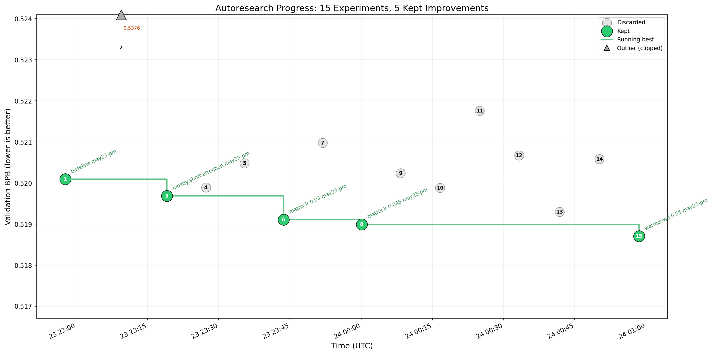

# autoresearch

> Convert your gaming PC into an autonomous AI researcher.

> This repository is a fork of [karpathy/autoresearch](https://github.com/karpathy/autoresearch). The purpose of this fork is native support for desktop consumer NVIDIA GPUs on Windows, with tiered VRAM floors by architecture.



*One day, frontier AI research used to be done by meat computers in between eating, sleeping, having other fun, and synchronizing once in a while using sound wave interconnect in the ritual of "group meeting". That era is long gone. Research is now entirely the domain of autonomous swarms of AI agents running across compute cluster megastructures in the skies. The agents claim that we are now in the 10,205th generation of the code base, in any case no one could tell if that's right or wrong as the "code" is now a self-modifying binary that has grown beyond human comprehension. This repo is the story of how it all began. -@karpathy, March 2026*.

The idea: give an AI agent a small but real LLM training setup and let it experiment autonomously overnight. It modifies the code, trains for 5 minutes, checks if the result improved, keeps or discards, and repeats. You wake up in the morning to a log of experiments and (hopefully) a better model. The training code here is a simplified single-GPU implementation of [nanochat](https://github.com/karpathy/nanochat). The core idea is that you're not touching any of the Python files like you normally would as a researcher. Instead, you are programming the `program.md` Markdown files that provide context to the AI agents and set up your autonomous research org. The default `program.md` in this repo is intentionally kept as a bare bones baseline, though it's obvious how one would iterate on it over time to find the "research org code" that achieves the fastest research progress, how you'd add more agents to the mix, etc. A bit more context on this project is here in this [tweet](https://x.com/karpathy/status/2029701092347630069).

## Start here (non-technical)

### What is actually happening?

This project trains a small AI language model on your own GPU, then lets a coding agent try to make it better, automatically, overnight.

A language model is a program that learns to read and predict text. The better it gets, the more accurately it can predict the next word in a sentence it has never seen before. That is the only thing being optimized here: how well the model predicts text.

The model starts knowing nothing. After 5 minutes of training it has learned the basic patterns of the text it was given. After many iterations it gets measurably better at that task.

What you end up with after each run is a saved model file (`checkpoint_pre_eval.pt`) and a score. Lower score means the model is better at predicting the text. That is the end product of a single run.

### Why would anyone care?

Most people who do AI research have access to large cloud computers and expensive GPUs. This project is about doing that same kind of iterative improvement loop on hardware you already own — a Windows gaming or workstation PC with an NVIDIA GPU.

The interesting part is that you are not the one making the changes. You set up instructions for a coding agent (such as Claude or Copilot), and the agent modifies the training code, runs it, checks the score, and decides what to try next. You are the director. The agent is the researcher. You wake up to a log of what it tried and what worked.

### What does the model learn on?

By default, this project trains on **TinyStories** — a collection of short, simple children's stories generated by GPT-4. You can browse the full dataset here:

**https://huggingface.co/datasets/karpathy/tinystories-gpt4-clean**

Why TinyStories:

- It is small enough to download in minutes and train on quickly.
- Short stories have clear, consistent language patterns — a good match for a small model.
- It gives a reliable baseline, so you can tell whether a change actually helped or hurt.
- It is much easier to inspect than large internet-scale datasets.

The model is not learning to be a general assistant. It is learning to predict short story text. That scope is intentional — it makes runs fast and results easy to compare.

### How does the training loop work?

1. `uv run prepare.py` — downloads TinyStories and builds a vocabulary (called a tokenizer) that converts words and characters into numbers the model can process. It also marks the end of each story with an **end-of-sequence (EOS) token**, so the model learns where stories naturally conclude. This is a one-time setup step; re-run it if you switch datasets.
2. `uv run train.py` — trains the model for 5 minutes on the stories, then tests it on a separate set of stories it has never seen. At the end it prints a score.
3. You (or the agent) review the score, change something in `train.py`, and run again.
4. Repeat. Keep changes that lower the score.

### What is the score (`val_bpb`)?

`val_bpb` stands for "validation bits per byte." Ignore the name. What it measures is: how surprised is the model when it sees new text it was not trained on? Lower surprise = lower score = better model.

A rough feel for the numbers:

- A completely untrained model scores around 8–9.
- A reasonable small model after 5 minutes scores below 1.
- Improvements of 0.01–0.05 across runs are meaningful at this scale.

### What do I actually have at the end?

After a completed run you have:

- **`checkpoint_pre_eval.pt`** — a saved snapshot of the model weights at the end of training. This is what the model "knows." It is overwritten each run, so save a copy if you want to keep a particular version.
- **A terminal log** (or a file like `run1.log` if you redirect output) — shows every training step, the final score, VRAM used, and how long it took.

The main output is the checkpoint and its score, not a packaged application. This repo does include simple local inference tools (`generate.py` and `chat.py`) so you can sample from the trained model, but the primary purpose of the project is the research loop itself — finding which training configurations produce the best scores — not deployment.

### But I want to actually run my model

You can. There are two ways to interact with it.

**`chat.py` — browser UI.** Opens a local page at `http://localhost:8000` where you type a prompt and watch the model continue it word by word in real time. Sliders let you adjust how creative or focused the output is.

```powershell
uv run chat.py
```

**`generate.py` — terminal.** Prints the continuation directly. Good for quick checks, scripting, or saving output to a log file.

```powershell
uv run generate.py "Once upon a time"
uv run generate.py "The little dog" --max-tokens 200
uv run generate.py "Once upon a time" --temperature 1.2
```

Both scripts detect the model architecture automatically from the checkpoint — no configuration needed.

**What to expect:** The model trained on TinyStories will continue your prompt in the style of short children's stories. The quality depends directly on how many training iterations have run and how well the settings have been tuned. An early model produces plausible but odd sentences. A well-tuned model reads more coherently. Watching that improvement across runs is the point of the project.

If you switch to a different dataset later, the model will reflect the style and content of that data instead.

### Which files do I touch?

| File | Who edits it | What it is |
|---|---|---|
| `program.md` | You | Instructions that tell the coding agent what to try next |
| `train.py` | The agent (or you) | The model and training settings — this is what gets improved |
| `prepare.py` | Nobody | Data download and evaluation wiring — do not modify |

### What does a successful run look like?

When you run `uv run train.py` you will see GPU info, then progress lines like:

```
step 00012 | loss: 3.21 | tok/sec: 78,000 | remaining: 180s
```

At the end, a summary block:

```
---
val_bpb:          0.818
training_seconds: 302.6
peak_vram_mb:     6309.3
```

If the run ends with that `---` block, it worked. If it ends with a Python error (traceback), something went wrong.

### What about using different datasets?

Stay on TinyStories until you have stable, repeatable runs. Then consider other data.

The reason for this order: TinyStories is already fully wired in. It gives you a known reference point. Without a working baseline you cannot tell whether a new dataset is giving you better results or just different-looking numbers.

When you are ready for other datasets, the dataset definitions live in `prepare.py` under `DATASET_CONFIGS`. Adding a new one requires adding it there and running `prepare.py` again to download and prepare it.

## Technical reference

## Fork scope

- Upstream source: [karpathy/autoresearch](https://github.com/karpathy/autoresearch)
- Primary objective: run natively on Windows with NVIDIA GPUs that meet the architecture VRAM floor (Turing with >=8 GB VRAM, Ampere/Ada/Blackwell with >=10 GB VRAM), without unofficial Triton-on-Windows stacks.
- Scope of changes: compatibility and stability updates required for that target platform.
- The original Linux/H100-oriented path from upstream is removed in this fork and is not supported here.
- High-end laptop/workstation GPUs are supported when they meet the same VRAM floors, though power and thermal variance can still affect throughput.
- If you need the upstream Linux/H100 path, use [karpathy/autoresearch](https://github.com/karpathy/autoresearch).

## How it works

The repo is deliberately kept small and really only has three files that matter:

- **`prepare.py`** — fixed constants, one-time data prep (downloads the TinyStories GPT-4 clean dataset, trains a BPE tokenizer), and runtime utilities (dataloader, evaluation).
- **`train.py`** — the single file the agent edits. Contains the full GPT model, optimizer (Muon + AdamW), and training loop. Everything is fair game: architecture, hyperparameters, optimizer, batch size, etc. **This file is edited and iterated on by the agent**.
- **`program.md`** — baseline instructions for one agent. Point your agent here and let it go. **This file is edited and iterated on by the human**.

By design, training runs for a **fixed 5-minute time budget** (wall clock, excluding startup/compilation), regardless of the details of your compute. The metric is **val_bpb** (validation bits per byte) — lower is better, and vocab-size-independent so architectural changes are fairly compared.

## Quick start (PowerShell)

**Requirements:** A single NVIDIA GPU, Python 3.10+, [uv](https://docs.astral.sh/uv/).

- Single runtime path uses PyTorch SDPA attention and eager execution (no FA3/`torch.compile` fast path).
- Native Windows support targets desktop consumer GPUs with a tiered VRAM policy (Turing >=8 GB, Ampere/Ada/Blackwell >=10 GB), official PyTorch CUDA wheels, and SDPA attention.
- Default dataset is TinyStories GPT-4 clean (`karpathy/tinystories-gpt4-clean`) for practical consumer-GPU setup.

```powershell

# 1. Install uv project manager (if you don't already have it)
powershell -ExecutionPolicy ByPass -c "irm https://astral.sh/uv/install.ps1 | iex"

# 2. Install dependencies
uv sync

# 3. Download data and train tokenizer (one-time)
#    Default dataset: TinyStories GPT-4 clean (`karpathy/tinystories-gpt4-clean`)
uv run prepare.py

# 4. Manually run a single training experiment (~5 min)
uv run train.py
```

Quick validation run (recommended after setup):

```powershell
uv run train.py --smoke-test
```

If the above commands all work ok, your setup is working and you can go into autonomous research mode.

## Running the agent

Simply spin up your Claude/Codex or whatever you want in this repo (and disable all permissions), then you can prompt something like:

```
Hi have a look at program.md and let's kick off a new experiment! let's do the setup first.
```

The `program.md` file is essentially a super lightweight "skill".

## Project structure

```
prepare.py      — constants, data prep + runtime utilities (do not modify)
train.py        — model, optimizer, training loop (agent modifies this)
generate.py     — load a checkpoint and generate text from a prompt (terminal)
chat.py         — local browser UI for the trained model (streams output)
program.md      — agent instructions
pyproject.toml  — dependencies
```

## Design choices

- **Single file to modify.** The agent only touches `train.py`. This keeps the scope manageable and diffs reviewable.
- **Fixed time budget.** Training always runs for exactly 5 minutes, regardless of your specific platform. This means you can expect approx 12 experiments/hour and approx 100 experiments while you sleep. There are two upsides of this design decision. First, this makes experiments directly comparable regardless of what the agent changes (model size, batch size, architecture, etc). Second, this means that autoresearch will find the most optimal model for your platform in that time budget. The downside is that your runs (and results) become not comparable to other people running on other compute platforms.
- **Self-contained.** No external dependencies beyond PyTorch and a few small packages. No distributed training, no complex configs. One GPU, one file, one metric.

## Platform support

This fork's platform policy is explicit and tiered.

This matters for machines like the Dell Precision 7780: an RTX 4000 Ada Laptop GPU with 12 GB VRAM is now inside the supported Ada floor, so it should be treated as a supported profile rather than a fallback-only profile.

| Architecture | Minimum VRAM floor | Supported NVIDIA GPUs |
| --- | --- | --- |
| Turing | `>=8 GB` | `RTX 2060 12GB`, `RTX 2060 SUPER 8GB`, `RTX 2070 8GB`, `RTX 2070 SUPER 8GB`, `RTX 2080 8GB`, `RTX 2080 SUPER 8GB`, `RTX 2080 Ti 11GB` |
| Ampere | `>=10 GB` | `RTX 3060 12GB`, `RTX 3080 10GB`, `RTX 3080 12GB`, `RTX 3080 Ti 12GB`, `RTX 3090 24GB`, `RTX 3090 Ti 24GB` |
| Ada | `>=10 GB` | `RTX 4060 Ti 16GB`, `RTX 4070 12GB`, `RTX 4070 SUPER 12GB`, `RTX 4070 Ti 12GB`, `RTX 4070 Ti SUPER 16GB`, `RTX 4080 16GB`, `RTX 4080 SUPER 16GB`, `RTX 4090 24GB` |
| Blackwell | `>=10 GB` | `RTX 5060 Ti 16GB`, `RTX 5070 12GB`, `RTX 5070 Ti 16GB`, `RTX 5080 16GB`, `RTX 5090 32GB` |
- Laptop and mobile workstation GPUs are supported when they meet the VRAM floor, but power and thermal variance may reduce achievable batch sizes.
- Floor policy: Turing desktop GPUs are supported at >=8 GB VRAM; Ampere/Ada/Blackwell desktop GPUs require >=10 GB VRAM.
- `RTX 2060 6GB` remains out of matrix support due to VRAM floor.
- Runtime path is intentionally unified across platforms: PyTorch SDPA attention + eager optimizer steps.
- Runtime adaptation is profile-driven: compute capability, BF16/TF32 support, OS, and VRAM tier determine candidate batch sizes and checkpointing strategy.
- Supported consumer profiles run a short eager-mode autotune pass and cache the selected candidate per GPU/runtime fingerprint.
- Autotune env controls: `AUTORESEARCH_DISABLE_AUTOTUNE=1` skips probing; `AUTORESEARCH_AUTOTUNE_REFRESH=1` refreshes the cached decision.
- Tested hardware in this repo remains RTX 3080 10 GB on Windows. Other listed SKUs are matrix-supported but may be less field-tested here.
- Non-goals for this fork include FA3/H100-specialized paths, unofficial Triton-for-Windows stacks, AMD/ROCm, Apple Metal, and multi-GPU training.
- Default dataset is TinyStories GPT-4 clean (`karpathy/tinystories-gpt4-clean`); the local parquet filename is `tinystories_gpt4_clean.parquet`.

## License

MIT
