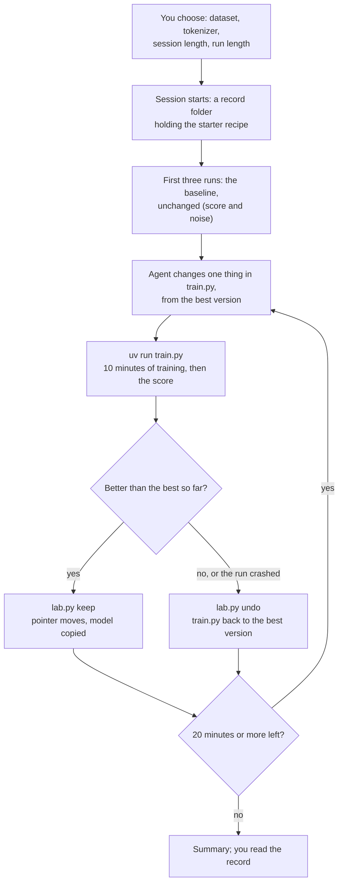

# autoresearch

> Convert your gaming PC into an autonomous AI researcher.

> This repository is a fork of [jsegov/autoresearch-win-rtx](https://github.com/jsegov/autoresearch-win-rtx) — the Windows/consumer-GPU port of [karpathy/autoresearch](https://github.com/karpathy/autoresearch). Lineage: karpathy/autoresearch → jsegov/autoresearch-win-rtx (native Windows support for desktop consumer NVIDIA GPUs, with tiered VRAM floors by architecture; git remote `upstream`) → this repo (adds the experiment record, `record.py` and `lab.py`; run entries with sample stories, `capture.py`; `chat.py` and `generate.py`; a library of trained models; and training tweaks).

*One day, frontier AI research used to be done by meat computers in between eating, sleeping, having other fun, and synchronizing once in a while using sound wave interconnect in the ritual of "group meeting". That era is long gone. Research is now entirely the domain of autonomous swarms of AI agents running across compute cluster megastructures in the skies. The agents claim that we are now in the 10,205th generation of the code base, in any case no one could tell if that's right or wrong as the "code" is now a self-modifying binary that has grown beyond human comprehension. This repo is the story of how it all began. -@karpathy, March 2026*.

The idea: give an AI agent a small but real LLM training setup and let it experiment autonomously for hours at a time. It modifies the code, trains for a fixed time (10 minutes here; 5 in Karpathy's original), checks if the result improved, keeps or discards, and repeats. When you come back, you have a log of experiments and (hopefully) a better model. The training code here is a simplified single-GPU implementation of [nanochat](https://github.com/karpathy/nanochat). The core idea is that you're not touching any of the Python files like you normally would as a researcher. Instead, you are programming the `program.md` Markdown files that provide context to the AI agents and set up your autonomous research org. The default `program.md` in this repo is intentionally kept as a bare bones baseline, though it's obvious how one would iterate on it over time to find the "research org code" that achieves the fastest research progress, how you'd add more agents to the mix, etc. A bit more context on this project is here in this [tweet](https://x.com/karpathy/status/2029701092347630069).

## Try it live (no setup)

**https://autoresearch-demo.fly.dev/** — the same `chat.py` UI this repo ships, hosted and public. No install, no GPU, no login. You get the two models from the session in [`WALKTHROUGH.md`](WALKTHROUGH.md) side by side — **Baseline** (`75027e8`, val_bpb 0.520096) and **Best** (`e9fffd9`, 0.518708) — plus the 16-experiment progress chart and the vocabulary browser. Type a prompt, watch both continue it, and see what one afternoon of tuning is actually worth: the two write almost alike. The session's whole gain (0.27%) is smaller than the difference between two runs of the same code, which is exactly why the agent needs a score. For decisions whose effect you *can* read, start with [TRAINING-DECISIONS.md](TRAINING-DECISIONS.md).

One honest caveat: the machine sleeps when nobody is using it, so **the first page load takes ~12 seconds** while it wakes up. Every load after that is instant (~0.07 s) until it goes back to sleep. It runs CPU-only, which is fine — these are ~19M-parameter models. Generation is capped there (max 500 tokens, top-k ≤ 200, prompts up to 2,000 characters); everything else matches what you get locally.

## Reading this repo

This repo is two things at once: a working research rig you can run yourself, and the record of an actual autonomous research session that already ran here, in May 2026. That session predates the experiment record and used git: `train.py` as committed is its best recipe, the root `results.tsv` is its scoreboard, and `checkpoints/` holds its saved models, named by 7-character commit hashes. Sessions you run now keep their own record in a folder, `sessions/<name>/`, and never use git (see **[The record](#the-record)**).

| Where to look | What you'll find |
|---|---|
| [`TRAINING-DECISIONS.md`](TRAINING-DECISIONS.md) | Start here: what this demonstrates, in plain language |
| [`WALKTHROUGH.md`](WALKTHROUGH.md) | The guided tour of the May session, failures included |
| [`results.tsv`](results.tsv) | The May session's scoreboard, one row per experiment |
| [`program.md`](program.md) | The agent's instructions: the whole "program" it follows |
| `sessions/<name>/` | A session's record, once you run one: every version of `train.py`, every run, the best version |
| [`chat.py`](chat.py) | A browser page that runs two of the models side by side on your prompt |
| [Live demo](https://autoresearch-demo.fly.dev/) | That same UI, hosted: meet the models with zero setup (first load ~12 s) |
| [`analysis.ipynb`](analysis.ipynb) + [`progress.png`](progress.png) | The May session's score trajectory |
| [`library/`](library/README.md) | Models trained for the Training Decisions explorer: baselines, a Folktales session, a ten-minute study |

---

## Start here (non-technical)

### What is actually happening?

This project trains a small AI [language model](https://en.wikipedia.org/wiki/Language_model) on your own GPU, then lets a coding agent improve the *training recipe* (the code and settings that turn data into a model) automatically, running experiments unattended for hours at a time while you do something else.

A language model is a program that learns to read and predict text. The better it gets, the more accurately it can predict the next word in a sentence it has never seen before. That is the only thing being optimized here: how well the model predicts text.

Each run trains a new model from scratch: it starts knowing nothing, and after 10 minutes of training it has learned the basic patterns of the text it was given. That is the only place training happens. Across many runs the agent changes the recipe and keeps the changes that score better, so later runs produce better models; no model keeps learning from one run to the next. [TRAINING-DECISIONS.md](TRAINING-DECISIONS.md) explains the difference.

What you end up with after each run is a saved model file (`checkpoint_pre_eval.pt`) and a score. Lower score means the model is better at predicting the text. That is the end product of a single run.

### Why would anyone care?

Most people who do AI research have access to large cloud computers and expensive GPUs. This project is about doing that same kind of iterative improvement loop on hardware you already own — a Windows gaming or workstation PC with an NVIDIA GPU.

The interesting part is that you are not the one making the changes. You set up instructions for a coding agent (such as Claude or Copilot), and the agent modifies the training code, runs it, checks the score, and decides what to try next. You are the director. The agent is the researcher. When you come back, you have a log of what it tried and what worked.

### What does the model learn on?

By default, this project trains on **TinyStories** — a collection of short, simple children's stories generated by GPT-4. You can browse the full dataset here:

**https://huggingface.co/datasets/karpathy/tinystories-gpt4-clean**

Why TinyStories:

- It is small enough to download in minutes and train on quickly.
- Short stories have clear, consistent language patterns — a good match for a small model.
- It gives a reliable baseline, so you can tell whether a change actually helped or hurt.
- It is much easier to inspect than large internet-scale datasets.

The model is not learning to be a general assistant. It is learning to predict short story text. That scope is intentional — it makes runs fast and results easy to compare.

### The three files that matter

- **`program.md`** — the agent's instructions. The default is ready to use out of the box. It is fixed during a session; between sessions you may edit it, though there is seldom a reason to: it sets how experiments are run and judged, and the agent supplies the ideas.
- **`train.py`** — the model and training code. The agent edits this to run experiments. You can edit it too, but normally you let the agent handle it.
- **`prepare.py`** — data prep and evaluation wiring. Do not modify this file.

### Inputs and outputs at a glance

**What you put in:**

| Input | Where it lives |
|---|---|
| Your choices: the dataset, the tokenizer, the session's length (10 hours by default) and each run's length (10 minutes) | `prepare.py --dataset --tokenizer`, then `lab.py start` (see **[The record](#the-record)**) |
| The agent's instructions | `program.md`: the default works as is, and it is fixed during a session |
| Model architecture, optimizer, hyperparameters | `train.py`: the agent edits this |
| Fixed rules: time budget, evaluation method, tokenizer | `prepare.py`: read-only for the agent |
| An NVIDIA GPU | Your PC |

**What you get out:**

| Output | Where it lives |
|---|---|
| Score for each run | Printed at the end of each run, and kept in the run's entry |
| The session's record | `sessions/<name>/`: every version of `train.py`, one entry per run (score, keep, discard or crash, what was tried, sample stories), a pointer to the best version, and `results.tsv` |
| Kept models | `checkpoints/<run>.pt`, copied by `lab.py keep` |
| The last run's model | `checkpoint_pre_eval.pt`, replaced by every run |

### Your first run

Open a PowerShell terminal in the repo folder and run these three commands in order. In VS Code, use **Terminal → New Terminal** from the menu bar — it opens directly in the right folder.

```powershell
# Step 1 — install dependencies (one-time)
uv sync

# Step 2 — download data and prepare it for training (one-time)
uv run prepare.py

# Step 3 — run one training experiment (10 minutes of training, plus a few to score it)
uv run train.py
```

Step 1 and 2 only need to be done once. This first run is a test outside any session, so its run file goes to `runs/`; the agent's runs belong to a session (see **[The record](#the-record)**).

At the end of step 3 you will see a short summary block with your score. If it printed a score without a Python error, your setup is working.

Once this works, head to the **[Running the agent](#running-the-agent)** section to launch the autonomous experiment loop.

### How does the training loop work?

There are two parts: a one-time setup by you, then a session that the agent runs alone.

**Setup (you do this once per session):**

1. `uv run prepare.py` (with `--dataset` and `--tokenizer` if you want other than the defaults) downloads the data, builds the **tokenizer** (the vocabulary that maps text to numbers), and sets aside text the model never trains on, for scoring.
2. Start the agent with the prompt from **[Running the agent](#running-the-agent)**. It starts the session's record (`uv run lab.py start`) if there is none.

**The session (the agent does this, without you):**

3. The first three runs train the starter recipe unchanged: the baseline. Their average is the first score to beat, and their spread is the session's noise, how far apart two runs of the same recipe land.
4. The agent changes one thing in `train.py`, starting from the best version so far.
5. It runs `uv run train.py`: 10 minutes of training, then the score.
6. If the score beats the best so far, it runs `uv run lab.py keep`: the pointer moves to this version and a copy of the model is saved. Otherwise, or if the run crashed, it runs `uv run lab.py undo`: `train.py` goes back to the best version. Either way the run's entry records the decision and what was tried, and nothing is deleted.
7. It repeats from step 4 while 20 minutes or more of the session remain (10 hours by default), then writes a summary and stops.

You come back and read the record: `uv run lab.py history` lists every run.


```mermaid
flowchart TD
    A["You choose: dataset, tokenizer,\nsession length, run length"] --> B["Session starts: a record folder\nholding the starter recipe"]
    B --> C["First three runs: the baseline,\nunchanged (score and noise)"]
    C --> D["Agent changes one thing in train.py,\nfrom the best version"]
    D --> E["uv run train.py\n10 minutes of training, then the score"]
    E --> F{Better than the best so far?}
    F -->|yes| G["lab.py keep\npointer moves, model copied"]
    F -->|"no, or the run crashed"| H["lab.py undo\ntrain.py back to the best version"]
    G --> I{20 minutes or more left?}
    H --> I
    I -->|yes| D
    I -->|no| J["Summary; you read the record"]
```

### What is the score (`val_bpb`)?

`val_bpb` stands for "validation bits per byte." Ignore the name. What it measures is: how surprised is the model when it sees new text it was not trained on? Lower surprise = lower score = better model.

A rough feel for the numbers:

- A completely untrained model scores around 8–9.
- A reasonable small model after a few minutes of training scores below 1.
- Two runs of the same code on the same laptop differ by about 0.003 (measured on 6 October 2026 with 5-minute runs: 0.521 and 0.524), because the GPU fits a slightly different number of steps into the fixed time. Each session now measures its own noise from its three baseline runs; `uv run lab.py status` shows it. A run that beats the best is kept even if the gain is smaller than the noise, and the agent says so in its description.
- The whole session in [`WALKTHROUGH.md`](WALKTHROUGH.md) improved the score by 0.0014 (0.27%), smaller than that noise. That is the honest size of what tuning found, and it is too small to read in the writing.

### What do I actually have at the end?

After a session you have:

- **The session's record** — `sessions/<name>/`: every version of `train.py` that trained (`versions/`), one entry per run with its score, decision, description and sample stories (`runs/`), a pointer to the best version (`best.json`), and the scoreboard (`results.tsv`). `uv run lab.py history` and `uv run lab.py diff` read it. To share a session, share its folder.
- **Kept models** — `checkpoints/<run>.pt`, one for each kept run, copied by `lab.py keep`.
- **The last run's model** — `checkpoint_pre_eval.pt`, replaced by every run, kept or not.
- **A terminal log** — `run.log`, the full output of the last run.
- **`analysis.ipynb`** — a notebook that plots `val_bpb` from the root `results.tsv`, the May session's. To plot your own session, point it at `sessions/<name>/results.tsv`.

The May session's saved models in `checkpoints/` are tracked with Git LFS. On GitHub Pro, the included LFS quota is 10 GiB storage and 10 GiB/month bandwidth before metered overages. A session's own models stay on your laptop.

The main output is the record and its best score, not a packaged application. This repo does include simple local inference tools (`generate.py` and `chat.py`) so you can sample from the trained models, but the primary purpose of the project is the research loop itself.

### But I want to actually run my model

You can. There are two ways to interact with it.

**`chat.py` — browser UI.** Opens a local page at `http://localhost:8000` where you type a prompt and watch the model continue it word by word in real time. Sliders let you adjust how creative or focused the output is.

```powershell
uv run chat.py
```

**`generate.py` — terminal.** Prints the continuation directly. Good for quick checks, scripting, or saving output to a log file.

```powershell
uv run generate.py "Once upon a time"
uv run generate.py "The little dog" --max-tokens 200
uv run generate.py "Once upon a time" --temperature 1.2
```

Both scripts detect the model architecture automatically from the checkpoint — no configuration needed.

**What to expect:** The model trained on TinyStories will continue your prompt in the style of short children's stories. The quality depends on how far the model got in its 10 minutes of training and on how well the recipe has been tuned. Early in training the model writes nonsense; after a few minutes it writes simple stories. Between a good recipe and a slightly better one, the difference is usually too small to read, which is why the agent judges by the score. The decisions you can read are the big ones: the dataset, the tokenizer, and how long the model trains.

If you switch to a different dataset later, the model will reflect the style and content of that data instead.

### How do I use `program.md` with an AI assistant?

Think of `program.md` as the agent's instructions. **You do not need to change it** — the default file is already a complete set of instructions. Just point your agent at it and go.

It is fixed for the whole session: the record saves a copy when the session starts and refuses to train if it changes (`uv run lab.py restore` puts it back). Between sessions you may edit it, though there is seldom a reason to: it sets how experiments are run and judged, and the agent supplies the ideas.

A practical cycle:

1. Choose the dataset and tokenizer (`uv run prepare.py --dataset ... --tokenizer ...`).
2. Start the agent with the prompt in **[Running the agent](#running-the-agent)**.
3. Come back after the session and read the record (`uv run lab.py history`).
4. Choose what to run next, and start a new session.

Edits a person might make to `program.md` between sessions:

- Narrow scope (for example: "focus only on optimizer changes").
- Add guardrails (for example: "avoid changes that increase VRAM above X GB").
- Raise or lower risk appetite (for example: "prefer simple tweaks" vs "try larger architecture changes").

### How long does the agent run?

A session lasts **10 hours** by default, and every run trains for **10 minutes** (`TIME_BUDGET = 600` in `prepare.py`). Before each run the agent checks the time with `uv run lab.py status`; with less than 20 minutes left it starts no new run, writes a summary and stops, so every session ends on a clean record. If the agent stops early, `session.py` starts it again.

How many runs a session holds, measured on a laptop RTX 4000 Ada:

- **One run takes 13–16 minutes:** 10 minutes of training, plus startup, the fixed evaluation (2–3 minutes on consumer GPUs), the sample stories, and the agent's own reading and editing.
- **That is about 4 runs an hour**, or **about 40 in a 10-hour session**, including the three baseline runs, before crashes and retries.
- `total_seconds` in each run's summary gives the exact figure for your machine.

**Context window limits are the other practical constraint.** CLI agents — Claude Code and Codex — run as persistent terminal processes and are designed for long autonomous sessions; they are the most reliable choice. Chat-based agents like GitHub Copilot accumulate context in the chat panel with each experiment; sessions of more than ~20–30 iterations may require starting a new chat as the context fills, which interrupts the loop.

### What does a successful run look like?

When you run `uv run train.py` you will see GPU info, then a single-line progress indicator that updates in place:

```
step 00012 (0.2%) | loss: 9.011872 | lrm: 0.08 | dt: 474ms | tok/sec: 69,124 | mfu: n/a | epoch: 1 | remaining: 299s
```

At the end, a summary block. This one is real, from a laptop RTX 4000 Ada on 6 October 2026, when runs trained for 5 minutes; a 10-minute run shows about 600 for `training_seconds`:

```
---
val_bpb:          0.520082
training_seconds: 300.4
total_seconds:    464.6
peak_vram_mb:     6799.2
mfu_percent:      n/a
total_tokens_M:   21.0
num_steps:        641
num_params_M:     18.9
depth:            6
dataset:          tinystories
train_batch_size: 8
eval_batch_size:  8
activation_checkpointing: disabled
```

### What about using different datasets or tokenizers?

Stay on TinyStories with its own tokenizer until you have stable, repeatable runs. Then change one decision at a time. Two datasets and three tokenizers are built in, and choosing them is a human step (the agent never changes them):

```powershell
uv run prepare.py --dataset folktales                       # folk and myth tales instead of TinyStories
uv run prepare.py --dataset tinystories --tokenizer phi3    # Phi-3 / Llama 2 vocabulary (32,011 tokens)
uv run prepare.py --dataset tinystories --tokenizer gpt2    # GPT-2 vocabulary (50,257); needs about 10 GB of GPU memory
uv run prepare.py --dataset tinystories --tokenizer own     # back to the default
```

`prepare.py` downloads what it needs and makes that pair active; `train.py`, `generate.py` and `chat.py` all use the active pair, and each run file records it.

- `val_bpb` compares across tokenizers on the same dataset, never across datasets. Start a new session when you switch dataset or tokenizer: the record refuses a run from another pair. Phi-3 scores about 0.1% low: it counts one extra byte per document for its word-boundary marker, so treat differences smaller than that as ties.
- A model can only be chatted with under the pair it was trained with.
- To add your own dataset, add an entry to `DATASET_CONFIGS` and its name to `DATASET_CHOICES` in `prepare.py`.

### Can I change the time limit?

Yes, per session, and it is a human step. Every run trains for 10 minutes by default (`TIME_BUDGET = 600` in `prepare.py`; the agent may not change it). For another length, set it for the whole session:

```powershell
$env:AUTORESEARCH_TIME_BUDGET = 300                 # seconds, 60 to 3600
uv run lab.py start <name> --dataset tinystories --tokenizer own --run-minutes 5
```

- **A longer budget** gives each model more training steps. It can help larger models but makes each run take longer, and a small dataset such as Folktales starts to be memorised: in the library's ten-minute study, Folktales models scored worse at 10 minutes than at 5.
- **A shorter budget** makes the loop faster, but scores are noisier.
- Scores compare only between runs of the same length, which is why the length is set per session: the record refuses a run whose length is not the session's.

---

## Fork scope and lineage

- Lineage: [karpathy/autoresearch](https://github.com/karpathy/autoresearch) (original, Linux/H100-oriented) → [jsegov/autoresearch-win-rtx](https://github.com/jsegov/autoresearch-win-rtx) (the Windows/consumer-GPU port; git remote `upstream`) → this repository.
- Direct upstream: [jsegov/autoresearch-win-rtx](https://github.com/jsegov/autoresearch-win-rtx). Its objective, inherited here: run natively on Windows with NVIDIA GPUs that meet the architecture VRAM floor (Turing with >=8 GB VRAM, Ampere/Ada/Blackwell with >=10 GB VRAM), without unofficial Triton-on-Windows stacks.
- This repository's additions on top of jsegov's port: the experiment record (`record.py`, `lab.py`), run entries with sample stories (`capture.py`), local inference tools (`chat.py`, `generate.py`), the library of trained models, and training tweaks accumulated by the experiment loop.
- The original Linux/H100-oriented path was removed in the jsegov port and is not supported here. If you need it, use [karpathy/autoresearch](https://github.com/karpathy/autoresearch).
- High-end laptop/workstation GPUs are supported when they meet the same VRAM floors, though power and thermal variance can still affect throughput.

### Credits

- [Andrej Karpathy](https://github.com/karpathy) created the original [autoresearch](https://github.com/karpathy/autoresearch). In upstream commit `c92bee5` ("some docs on what to play with to make autoresearch better on smaller computers") he wrote: "Seeing as there seems to be a lot of interest in tinkering with autoresearch on much smaller compute platforms than an H100, a few extra words. If you're going to try running autoresearch on smaller computers (Macbooks etc.), I'd recommend one of the forks below." — and listed [jsegov/autoresearch-win-rtx](https://github.com/jsegov/autoresearch-win-rtx) under "Notable forks" as the Windows entry.
- [jsegov](https://github.com/jsegov) authored the Windows/consumer-GPU port (`autoresearch-win-rtx`) that this repository builds on.

## How it works

The repo is deliberately kept small and really only has three files that matter:

- **`prepare.py`** — fixed constants, one-time data prep (downloads the TinyStories GPT-4 clean dataset, builds the tokenizer: trained on the data by default, or a standard one), and runtime utilities (dataloader, evaluation).
- **`train.py`** — the single file the agent edits. Contains the full GPT model, optimizer (Muon + AdamW), and training loop. Everything is fair game: architecture, hyperparameters, optimizer, batch size, etc. **This file is edited and iterated on by the agent**.
- **`program.md`** — the agent's instructions. Point your agent here and let it go. **It is fixed during a session**; between sessions a person may edit it.

By design, training runs for a **fixed 10-minute time budget** (wall clock, excluding startup/compilation), regardless of the details of your compute. The metric is **val_bpb** (validation bits per byte) — lower is better, and vocab-size-independent so architectural changes are fairly compared.

## Quick start (PowerShell)

**Requirements:** A single NVIDIA GPU, Python 3.10+, [uv](https://docs.astral.sh/uv/), [git](https://git-scm.com/download/win), and [git-lfs](https://git-lfs.com) (only to download the May session's saved models in `checkpoints/`).

- Single runtime path uses PyTorch SDPA attention and eager execution (no FA3/`torch.compile` fast path).
- Native Windows support targets desktop consumer GPUs with a tiered VRAM policy (Turing >=8 GB, Ampere/Ada/Blackwell >=10 GB), official PyTorch CUDA wheels, and SDPA attention.
- Default dataset is TinyStories GPT-4 clean (`karpathy/tinystories-gpt4-clean`) for practical consumer-GPU setup.

> **Troubleshooting — Windows Smart App Control:** if Smart App Control is enabled, the uv-managed standalone Python builds fail to start with an error like `DLL load failed ... Application Control policy`, because those builds are unsigned and SAC blocks unsigned binaries. The fix is a signed interpreter from [python.org](https://www.python.org/downloads/): install the version this repo pins in `.python-version` (Python 3.14), then point the venv at it — `uv venv --python <path to signed python.exe>` followed by `uv sync`.

```powershell

# 1. Install uv project manager (if you don't already have it)
powershell -ExecutionPolicy ByPass -c "irm https://astral.sh/uv/install.ps1 | iex"

# 2. Install dependencies
uv sync

# 3. Download data and train tokenizer (one-time)
#    Default dataset: TinyStories GPT-4 clean (`karpathy/tinystories-gpt4-clean`)
uv run prepare.py

# 4. Manually run a single training experiment (10 min of training)
uv run train.py
```

Quick validation run (recommended after setup):

```powershell
uv run train.py --smoke-test
```

If the above commands all work ok, your setup is working and you can go into autonomous research mode.

## Running the agent

Any coding agent that can read files, edit code, and run terminal commands will work. The starting prompt is the same in all cases:

```
Read program.md, do the setup checks, and start a new experiment loop. Record each decision with `uv run lab.py keep` or `uv run lab.py undo`; never edit results.tsv.
```

`program.md` is a lightweight instruction playbook for the agent. Three common options:

### GitHub Copilot (VS Code)

Use **Agent mode** in the chat panel — not regular chat mode. Regular chat mode cannot run terminal commands or edit files autonomously; only Agent mode can.

Open the chat panel (`Ctrl+Alt+I`), switch to the **Agent** tab, then paste the prompt above and press Enter. The first time it tries to edit a file or run a terminal command, VS Code will show an **Allow / Deny** prompt — click **Always Allow** for both so the agent can run uninterrupted.

**To stop:** click the **Stop** button (square icon) in the chat panel.

### Claude Code (terminal)

[Claude Code](https://docs.anthropic.com/en/docs/claude-code) is Anthropic's CLI agent. Install it once, then run it from the repo root:

```powershell
# Install (one-time)
npm install -g @anthropic-ai/claude-code
```

**Interactive mode** (recommended) — opens a session you can watch and type follow-ups into. Press Ctrl+C to stop:

```powershell
claude "Read program.md, do the setup checks, and start a new experiment loop. Record each decision with `uv run lab.py keep` or `uv run lab.py undo`; never edit results.tsv."
```

By default Claude Code asks for permission before each file edit and shell command. For a long unattended session this will block — use one of the options below instead.

**Unattended / overnight** — use the session runner, `session.py`. It prepares the dataset and tokenizer, starts the session's record, launches Claude Code headless without permission prompts, and starts it again where it left off if its turn ends early. It starts no run in the session's last 20 minutes, ends the agent 25 minutes after the session's end, and stops at once if the sign-in fails. Run the same command again to continue a session that stopped; logs go to `session-logs/<name>/`.

```powershell
uv run session.py tinystories own --check      # every check, changing nothing (one short test reply)
uv run session.py tinystories own              # 10 hours of 10-minute runs
uv run session.py folktales phi3 --hours 6 --run-minutes 5
```

For a whole night, run `claude setup-token` first and set the token it prints as `CLAUDE_CODE_OAUTH_TOKEN`: the usual sign-in can expire after about two hours unattended. The agent runs commands without asking each time, so run it only in this folder.

**Selective permissions** — auto-approve file edits but still ask before running shell commands:

```powershell
claude --permission-mode acceptEdits "Read program.md, do the setup checks, and start a new experiment loop. Record each decision with `uv run lab.py keep` or `uv run lab.py undo`; never edit results.tsv."
```

**Headless mode** (`-p`) runs without a terminal session to watch. It works for the loop only if the agent follows `program.md`'s "Running headless?" rules: ending its turn ends the session, so it must run training in the foreground and never stop while a run is in progress. If its turn ends early, relaunch it with `claude -p --continue` (`session.py` does this for you); the record shows where it was. It is also handy for one-off questions:

```powershell
claude -p "Run uv run lab.py history and summarize the session so far"
```

**To stop:** press **Ctrl+C** in the terminal where `claude` is running.

### Codex CLI (terminal)

[Codex CLI](https://github.com/openai/codex) is OpenAI's terminal agent. Install it once, then run it from the repo root:

```powershell
# Install (one-time)
npm install -g @openai/codex
```

**Full-access mode** (recommended for unattended runs) — approves all file edits and shell commands without asking:

```powershell
codex exec -s danger-full-access "Read program.md, do the setup checks, and start a new experiment loop. Record each decision with `uv run lab.py keep` or `uv run lab.py undo`; never edit results.tsv."
```

With logging:

```powershell
codex exec -s danger-full-access "Read program.md, do the setup checks, and start a new experiment loop. Record each decision with `uv run lab.py keep` or `uv run lab.py undo`; never edit results.tsv." 2>&1 | Tee-Object -FilePath agent.log
```

**Sandbox modes (`-s`):**

| Mode | Behavior |
|---|---|
| `danger-full-access` | Approves all file edits and shell commands without asking — use for unattended runs |
| `workspace-write` | Auto-approves workspace file edits; asks before running shell commands |
| `read-only` | Read-only; asks before every action (will block during a long loop) |

**To stop:** press **Ctrl+C** in the terminal where `codex` is running.

## Managing runs

### How to stop an in-progress training run

If `train.py` is actively running when you stop the agent, press **Ctrl+C** in the terminal running the training process. If the terminal is not visible, find it in the VS Code Terminal panel.

You can stop at any time. The record is never left half-written: a run that started and never finished is recorded as a crash at the next decision, and `uv run lab.py status` and `uv run lab.py check` show exactly where things stand.

### Where does a run start from?

Each training run always begins from **randomly initialized weights** — it does not load or fine-tune the previous checkpoint. The saved models (`checkpoint_pre_eval.pt`, and the kept copies in `checkpoints/`) are only used when you run `generate.py` or `chat.py`.

What carries forward between runs is the **recipe** in `train.py`. The agent starts each change from the best version so far, which the session's record points to (`best.json`); `train.py` itself is only the working copy.

In practice this means:

- Stopping the agent does not lose research progress: the best version is in the record (`uv run lab.py status` names it, `uv run lab.py show <id>` prints it).
- Each individual training run starts from random weights regardless of what previous runs found.
- Each session's results stay in its own folder, `sessions/<name>/`.

### Resume or start over

To continue a session you stopped, start the agent again with the same prompt. It runs `uv run lab.py status`, sees any run that never finished (its next decision records it as a crash), and carries on in the same session until its end time.

To start over, start a new session. Earlier sessions stay as they are in their folders, so there is nothing to delete and nothing to reset. To train outside any session (a quick test, say), end the active one first with `uv run lab.py end`. A new session begins from whatever `train.py` holds when you start it, so put the recipe you want to start from in `train.py` first.

### The record

Experiments never use git. Each session keeps its record in its own folder, `sessions/<name>/`, which git ignores:

| In the folder | What it holds |
|---|---|
| `versions/` | Every version of `train.py` that trained, named by a 12-character id (from a hash of the code) |
| `runs/` | One entry per run: its version, the version it was changed from, score, keep, discard or crash, what was tried, and its sample stories |
| `best.json` | The pointer: which version is the best so far, and its score |
| `results.tsv` | The scoreboard, rewritten after every decision (its `commit` column holds the version id) |
| `fixed/` | Copies of the files the agent may not change (`program.md`, `prepare.py`, ...), taken when the session started |
| `session.json` | The session's dataset, tokenizer, run length, start and end |

`lab.py` reads and writes it:

```powershell
uv run lab.py status                 # the best version, the noise, whether train.py differs, time left
uv run lab.py history                # one line per run; * marks the best
uv run lab.py diff                   # what train.py changes from the best version
uv run lab.py show <id>              # print one version of train.py
uv run lab.py keep "<description>"   # the last run's version becomes the best; its model is copied
uv run lab.py undo "<description>"   # record the run as discard (or crash); train.py back to the best
uv run lab.py restore                # put back a fixed file that changed since the session started
uv run lab.py check                  # report anything inconsistent
uv run lab.py end                    # end the session (its folder stays); train.py then runs outside any session
uv run lab.py export --sqlite F      # rewrite results.tsv; optionally build a SQLite file
uv run lab.py start <name> --dataset tinystories --tokenizer own   # 10-minute runs, 10 hours by default
```

The agent decides with `keep` or `undo`; you can read everything else. Nothing in the folder is ever deleted, so every version and every run, kept or undone, stays available. The May session in this repo ran before the record existed and used git commits instead, which is why its scoreboard and checkpoints carry 7-character commit hashes.

## Project structure

```
prepare.py        — constants, data prep + runtime utilities (do not modify)
capture.py        — records each run: its sample stories and score (do not modify)
record.py         — the experiment record (do not modify)
lab.py            — the record's command line (do not modify)
session.py        — runs a session unattended with Claude Code, restarting the agent if it stops early
train.py          — model, optimizer, training loop (the agent modifies this)
program.md        — the agent's instructions
generate.py       — load a checkpoint and generate text from a prompt (terminal)
chat.py           — local browser UI for the trained models (streams output)
sessions/<name>/  — a session's record (git-ignored): versions/, runs/, best.json, results.tsv, fixed/
checkpoints/      — kept models (the May session's are tracked with Git LFS)
results.tsv       — the May session's scoreboard
runs/             — run files of runs trained outside a session
library/          — models and run files for the Training Decisions explorer
run.log           — latest run output (overwritten each run)
analysis.ipynb    — notebook: plots val_bpb from a results.tsv
TRAINING-DECISIONS.md — what this project demonstrates, in plain language
deploy/           — the hosted chat demo
pyproject.toml    — dependencies
```

## Design choices

- **Single file to modify.** The agent only touches `train.py`. This keeps the scope manageable and diffs reviewable.
- **Fixed time budget.** Training runs for exactly 10 minutes by default, controlled by `TIME_BUDGET = 600` in `prepare.py`; a person can set another length for a whole session. The agent cannot change it — `prepare.py` is read-only.
  - Throughput: one run takes 13–16 minutes on a consumer GPU (10 of training, plus startup, evaluation, sample stories and the agent's own time), so **about 4 an hour** and **about 40 in a 10-hour session** for a CLI agent (Claude Code or Codex), before crashes and retries. Chat-based agents (Copilot) are limited further by context window — plan for shorter sessions or multiple chat threads.
  - Upside 1: experiments stay directly comparable regardless of what the agent changes (model size, batch size, architecture, etc).
  - Upside 2: the system searches for the best model within a fixed per-run budget, so hardware differences affect quality but not comparability within a single machine.
  - Downside: your runs and results are not directly comparable to people on different hardware.
- **A record, not git, for experiments.** Each session's folder keeps every version of `train.py`, every run and a pointer to the best version, so nothing tried is lost and the agent never needs git.
- **Self-contained.** No external dependencies beyond PyTorch and a few small packages. No distributed training, no complex configs. One GPU, one file, one metric.

## Platform support

This fork's platform policy is explicit and tiered.

This matters for machines like the Dell Precision 7780: an RTX 4000 Ada Laptop GPU with 12 GB VRAM is now inside the supported Ada floor, so it should be treated as a supported profile rather than a fallback-only profile.

| Architecture | Minimum VRAM floor | Supported NVIDIA GPUs |
| --- | --- | --- |
| Turing | `>=8 GB` | `RTX 2060 12GB`, `RTX 2060 SUPER 8GB`, `RTX 2070 8GB`, `RTX 2070 SUPER 8GB`, `RTX 2080 8GB`, `RTX 2080 SUPER 8GB`, `RTX 2080 Ti 11GB` |
| Ampere | `>=10 GB` | `RTX 3060 12GB`, `RTX 3080 10GB`, `RTX 3080 12GB`, `RTX 3080 Ti 12GB`, `RTX 3090 24GB`, `RTX 3090 Ti 24GB` |
| Ada | `>=10 GB` | `RTX 4060 Ti 16GB`, `RTX 4070 12GB`, `RTX 4070 SUPER 12GB`, `RTX 4070 Ti 12GB`, `RTX 4070 Ti SUPER 16GB`, `RTX 4080 16GB`, `RTX 4080 SUPER 16GB`, `RTX 4090 24GB` |
| Blackwell | `>=10 GB` | `RTX 5060 Ti 16GB`, `RTX 5070 12GB`, `RTX 5070 Ti 16GB`, `RTX 5080 16GB`, `RTX 5090 32GB` |
- Laptop and mobile workstation GPUs are supported when they meet the VRAM floor, but power and thermal variance may reduce achievable batch sizes.
- Floor policy: Turing desktop GPUs are supported at >=8 GB VRAM; Ampere/Ada/Blackwell desktop GPUs require >=10 GB VRAM.
- `RTX 2060 6GB` remains out of matrix support due to VRAM floor.
- Runtime path is intentionally unified across platforms: PyTorch SDPA attention + eager optimizer steps.
- Runtime adaptation is profile-driven: compute capability, BF16/TF32 support, OS, and VRAM tier determine candidate batch sizes and checkpointing strategy.
- Supported consumer profiles run a short eager-mode autotune pass and cache the selected candidate per GPU/runtime fingerprint.
- Autotune env controls: `AUTORESEARCH_DISABLE_AUTOTUNE=1` skips probing; `AUTORESEARCH_AUTOTUNE_REFRESH=1` refreshes the cached decision.
- Tested hardware in this repo remains RTX 3080 10 GB on Windows. Other listed SKUs are matrix-supported but may be less field-tested here.
- Non-goals for this fork include FA3/H100-specialized paths, unofficial Triton-for-Windows stacks, AMD/ROCm, Apple Metal, and multi-GPU training.
- Default dataset is TinyStories GPT-4 clean. The Hugging Face dataset ID is `karpathy/tinystories-gpt4-clean`, while the local parquet filename is `tinystories_gpt4_clean.parquet`.

## License

MIT
